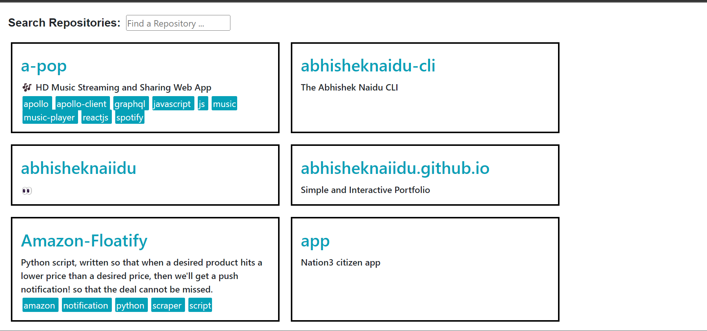
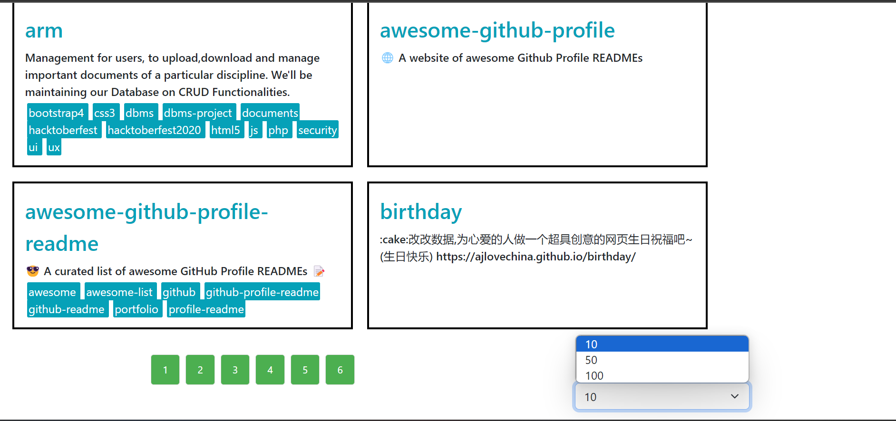

# Fyle

Features:-

1:- GitHub Profile Overview:

- >Display essential user information, including username, bio,user's avatar image, location, and Twitter handle.

2:-Repository Details:

- >Provide repository details such as name, description, and topics used.

3:- Repository List:

- >Present a paginated list of repositories, allowing users to navigate through multiple pages.

4:-Search Bar:

- >Incorporate a search bar to dynamically filter repositories based on user input.

5:-Customizable Repositories per Page:

- >Enable users to select the number of repositories displayed per page through a dropdown menu.

